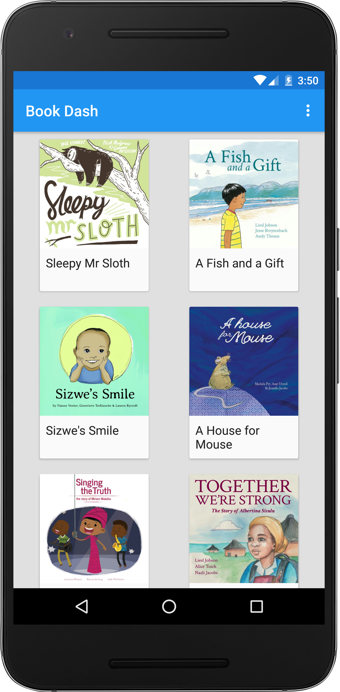
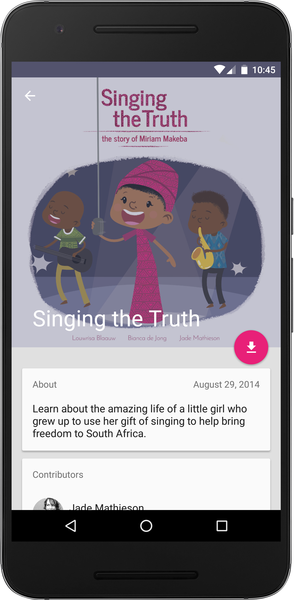
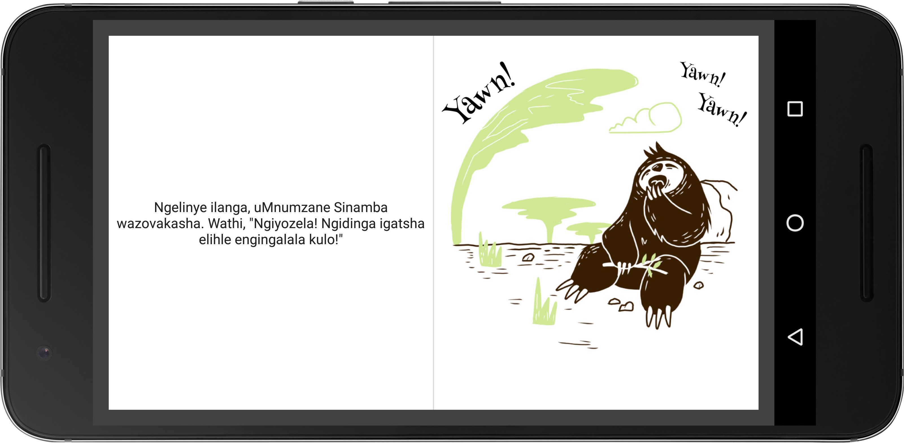
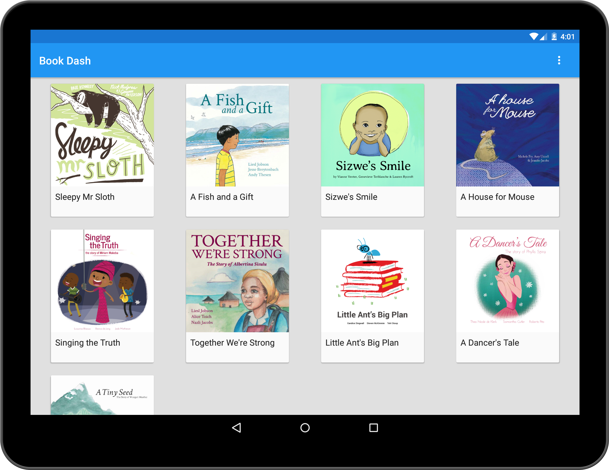
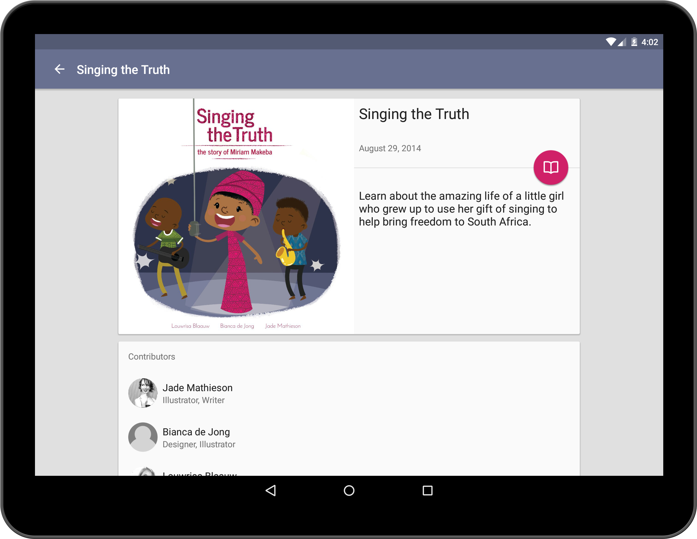
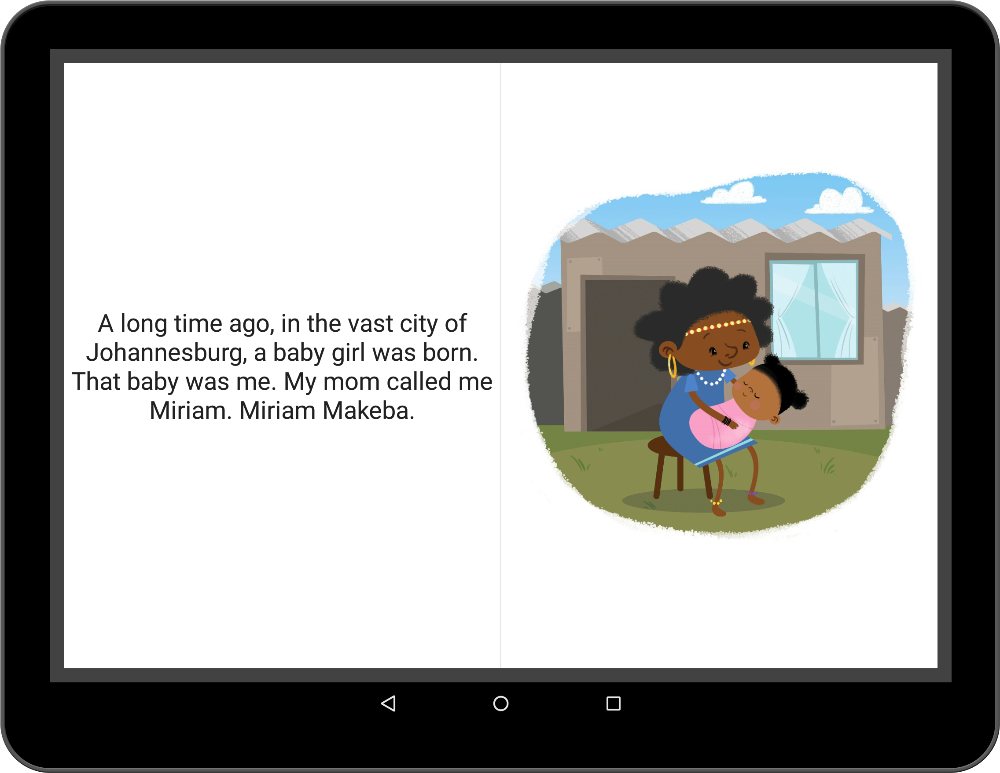

# Bookdash Android
Book Dash is an Android App for the NPO where you can download books in different languages for free.

# Screenshots

# What does this app do?
It is an open source Android application that allows people to download children's story books. The books are available
in different languages such as English, Sepedi, Zulu, Afrikaans etc. The books are free to distribute and translate.

The app is currently in open beta at the moment - any feedback or pull requests are welcome:
https://play.google.com/apps/testing/org.bookdash.android

Read more about Book Dash here:
http://bookdash.org/

# Libraries this app uses:

1. MaterialHelpTutorial - https://github.com/spongebobrf/MaterialIntroTutorial
2. FabButton - https://github.com/ckurtm/FabButton
3. Parse - https://parse.com
4. Fabric - https://fabric.io/dashboard
5. Glide Image Loading - https://github.com/bumptech/glide

# Setup

1. Clone or download this repo
2. Setup a Parse Account. https://parse.com
3. You will need to recreate the Parse Database. Click on "Core" and click "Import Data" you can find the example JSON here:
/parse_data_example/
4. Change the Parse API Key and Client Key in the file to your unique parse key: /appconfig-sample.properties .
5. Setup a Fabric Account. https://fabric.io/dashboard
6. Get your Fabric API Key and Client key, change it in the file: /app/fabric-sample.properties
7. If you wish to build a release version you will need to create your own keystore file and edit the password values in the following file - (create a version of the file without the .sample extension): release-keystore.properties.sample

# License
Copyright 2015 Book Dash.

Licensed to the Apache Software Foundation (ASF) under one or more contributor
license agreements. See the NOTICE file distributed with this work for
additional information regarding copyright ownership. The ASF licenses this
file to you under the Apache License, Version 2.0 (the "License"); you may not
use this file except in compliance with the License. You may obtain a copy of
the License at

http://www.apache.org/licenses/LICENSE-2.0

Unless required by applicable law or agreed to in writing, software
distributed under the License is distributed on an "AS IS" BASIS, WITHOUT
WARRANTIES OR CONDITIONS OF ANY KIND, either express or implied. See the
License for the specific language governing permissions and limitations under
the License.
