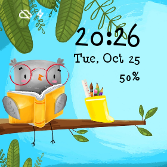
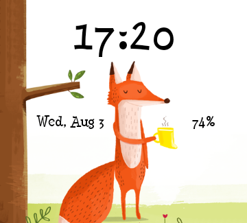

# Bookdash Android

Check out the blog post here: http://riggaroo.co.za/book-dash-android-app/

Download the app: https://play.google.com/store/apps/details?id=org.bookdash.android

Open Beta Testing Group: https://play.google.com/apps/testing/org.bookdash.android

Book Dash is an Android App for the NPO where you can download books in different languages for free.

# Screenshots

# What does this app do?
It is an open source Android application that allows people to download children's story books. The books are available
in different languages such as English, Sepedi, Zulu, Afrikaans etc. The books are free to distribute and translate.

Read more about Book Dash here:
http://bookdash.org/

# Libraries this app uses:

1. MaterialHelpTutorial - https://github.com/spongebobrf/MaterialIntroTutorial
2. FabButton - https://github.com/ckurtm/FabButton
3. Firebase - https://firebase.google.com/ 
4. Fabric - https://fabric.io/dashboard
5. Glide Image Loading - https://github.com/bumptech/glide

# Setup

1. Clone or download this repo.
2. This app runs off a Firebase backend. You will need to generate your firebase backend. To do this, navigate to https://firebase.google.com/ and sign up. Create a project called 
"Book Dash" (or what ever you want to call it). 
3. Navigate to "Database", select the three dots and then select "Import JSON". Select the file [server/firebase-sample-data.json](server/firebase-sample-data.json). 
Allow Firebase to import the data. You will also then need to place books in the storage container on firebase. You should be able to download some books,
 upload then and change the URL references to point to your book in your storage container.
4. The database rules and storage rules can also be imported into Firebase, those files are also located in the server folder. 
(For more info on getting your own server up and running, check out https://github.com/bookdash/bookdash-backend-admin-portal
5. You will need to generate your own google-services.json file to use with the app. Navigate to the Firebase project settings dashboard. You should see an option to download the 
google-services.json file. This must then be placed into the app folder of this project. 

# [OPTIONAL setup] 
1. If you wish to build a release version you will need to create your own keystore file and edit the password values in the following file - (create a version of the file without the .sample extension): release-keystore.properties.sample
2. Setup a Fabric Account. https://fabric.io/dashboard
3. Get your Fabric API Key and Client key, change it in the file: /app/fabric-sample.properties and rename the file to fabric.properties

# Contributions
Contributions are welcome. Please read the [contributions guide](CONTRIBUTING.md) for more information. 

# License
Copyright 2016 Book Dash.

Licensed to the Apache Software Foundation (ASF) under one or more contributor
license agreements. See the NOTICE file distributed with this work for
additional information regarding copyright ownership. The ASF licenses this
file to you under the Apache License, Version 2.0 (the "License"); you may not
use this file except in compliance with the License. You may obtain a copy of
the License at

http://www.apache.org/licenses/LICENSE-2.0

Unless required by applicable law or agreed to in writing, software
distributed under the License is distributed on an "AS IS" BASIS, WITHOUT
WARRANTIES OR CONDITIONS OF ANY KIND, either express or implied. See the
License for the specific language governing permissions and limitations under
the License.
